# GenAI: CV - HW 1 Report

**Author:** Nazar Protsiv
**Date:** 14 December 2025

---

## Table of Contents

1. [Introduction](#introduction)
2. [Normalizing Flows - RealNVP](#normalizing-flows---realnvp-5-points)
3. [Variational Autoencoders - VAE](#variational-autoencoders---vae-10-points)
4. [Generative Adversarial Networks - GAN](#generative-adversarial-networks---gan-10-points)
5. [Overall Discussion and Conclusions](#overall-discussion-and-conclusions)
6. [References](#references)

---

## Introduction

This report documents the implementation and experimentation of three major families of generative models: **Normalizing Flows (RealNVP)**, **Variational Autoencoders (VAE)**, and **Generative Adversarial Networks (GAN)**. All models were trained on MNIST Digits and Fashion-MNIST datasets to understand their strengths, weaknesses, and generation capabilities.

The project structure is organized as follows:
- `real_nvp/`: RealNVP implementation with coupling layers and multi-scale architecture
- `vae/`: VAE implementation with �-scheduling and cyclical annealing
- `ae/`: Standard autoencoder baseline
- `gan/`: Vanilla and Conditional GAN implementations with advanced discriminator variants
- `notebooks/`: Jupyter notebooks containing training loops and visualizations
- `data/saved_models/`: Trained model checkpoints

All implementations use **PyTorch Lightning** for clean, reproducible training pipelines.

---

## Normalizing Flows - RealNVP

### Architecture

The RealNVP model was implemented with the following key components:

#### 1. **Coupling Layers**
Affine coupling layers implementing the transformation:
```
z_masked = x_masked
z_unmasked = (x_unmasked + t(x_masked)) * exp(s(x_masked))
```

Where `s` and `t` are learned neural networks (GatedConvNet).

**Implementation:** [coupling_layer.py](real_nvp/coupling_layer.py)

#### 2. **GatedConvNet**
Custom gating mechanism inspired by PixelCNN++ and Glow:
- Uses ConcatELU activation (concatenates `[x, -x]` before ELU)
- Gated activation: `output = tanh(features) * sigmoid(gate)`
- LayerNorm for channel normalization

**Implementation:** [gated_convnet.py](real_nvp/gated_convnet.py)

#### 3. **Multi-Scale Architecture**
The flow model processes images at multiple resolutions:
- **Variational Dequantization**: 4 coupling layers with checkerboard masks
- **Low-level flow**: 4 coupling layers (28x28 resolution)
- **SqueezeFlow**: Spatial to channel conversion (28x28x1 -> 14x14x4)
- **After-squeeze flow**: 4 coupling layers with channel masking (14x14x4)
- **SplitFlow**: Half the channels are modeled with Gaussian prior
- **Second SqueezeFlow**: 14x14x2 -> 7x7x8
- **After-split flow**: 4 coupling layers with channel masking (7x7x8)

**Implementation:** [model_creation.py](real_nvp/model_creation.py)

#### 4. **Masking Strategies**
- **Checkerboard mask**: Alternating spatial masking for low-resolution flows
- **Channel mask**: Half-channel masking for high-resolution flows

### Results

#### MNIST Digits - Multi-Scale Flow

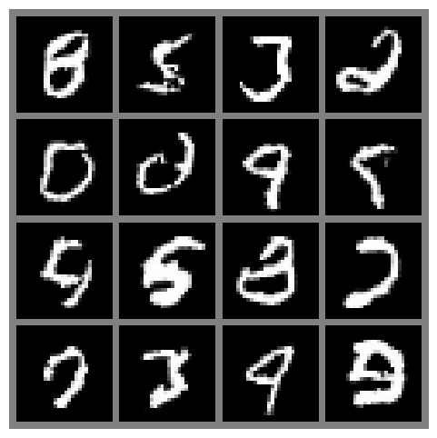

*Figure: Generated samples from simple RealNVP trained on MNIST Digits*

**Training Performance:**
- validation loss: `1.056827` bits/dim
- test loss: `1.054904` bits/dim
- Training epochs: 300 epochs

#### Fashion-MNIST - Multi-Scale Flow


*Figure: Generated samples from multi-scale RealNVP trained on Fashion-MNIST*

**Training Performance:**
- validation loss: `2.8443` bits/dim
- test loss: `2.8352` bits/dim
- Training epochs: 500 epochs

### Discussion

**What worked well:**
- Multi-scale architecture significantly improved generation quality compared to simple flow
- Variational dequantization helped smooth the discrete pixel values
- GatedConvNet provided stable training with good expressiveness
- Likelihood-based training gave clear optimization objective


**Why results might not be great:**
- Limited model capacity (hidden channels) may restrict expressiveness
- Checkerboard artifacts might appear due to masking patterns
- Fashion-MNIST is more complex, requiring more coupling layers or larger networks

**Potential improvements:**
- Increase hidden channel size in GatedConvNet (currently 32-64)
- Add more coupling layers per scale
- Experiment with different dequantization schemes
- Use learnable base distribution instead of standard Gaussian
- Implement Glow-style 1x1 convolutions for additional mixing

---

## Variational Autoencoders - VAE

### Part 1: Autoencoder Compression

#### Architecture

**Encoder:**
```
Input (1, 28, 28)
* Conv2d(1, 16, k=3, p=1, s=2) + GELU  [14x14]
* Conv2d(16, 16, k=3, p=1) + GELU
* Conv2d(16, 32, k=3, p=1, s=2) + GELU  [7x7]
* Conv2d(32, 32, k=3, p=1) + GELU
* Flatten -> Linear(32*7*7 x latent_dim)
```

**Decoder:**
```
Linear(latent_dim x 32*7*7)
� Reshape to (32, 7, 7)
� ConvTranspose2d(32, 32, k=3, p=1) + GELU
� Upsample(scale=2) [14x14]
� ConvTranspose2d(32, 16, k=3, p=1) + GELU
� ConvTranspose2d(16, 16, k=3, p=1) + GELU
� Upsample(scale=2) [2828]
� ConvTranspose2d(16, 1, k=3, p=1)
```

**Implementation:** [autoencoder.py](ae/autoencoder.py), [encoder.py](ae/encoder.py), [decoder.py](ae/decoder.py)

#### Latent Dimension Experiments

Trained autoencoders with varying latent dimensions: **32, 64, 128, 256**

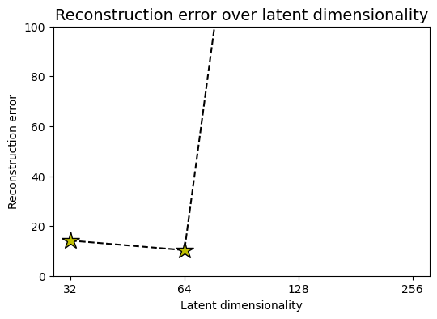

*Figure: Reconstruction error (MSE) vs. latent dimension for MNIST autoencoders*

**Results Summary:**
I got pretty good reconstructuion error on initial 32 size, and on 128 latent size and 256 model training did not converged, I think it is due to too large learning rate. It was better to expermimnet with another latent sizes like [8, 16, 32, 64] but there was a lack of time


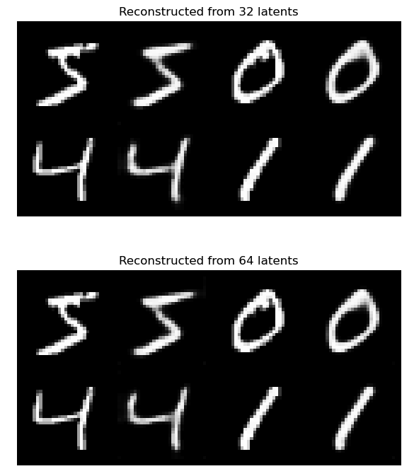

*Figure: Sample reconstructions for different latent dimensions (Original | 32-dim | 64-dim)*

### Part 2: Variational Autoencoder (VAE)

#### Architecture

The VAE extends the standard autoencoder with:

1. **Probabilistic Encoder**: Outputs $`\mu`$ and $log\,\sigma$ instead of deterministic latent code
2. **Reparameterization Trick**: $z = \mu + \sigma * \epsilon$ where $\epsilon \sim N(0, 1)$
3. **KL Divergence Loss**: Regularizes latent distribution to match standard Gaussian

**Implementation:** [model.py](vae/model.py), [encoder.py](vae/encoder.py)

#### beta-Scheduling Strategy

To prevent **posterior collapse** (where the model ignores the latent code), implemented:

1. **Linear Warmup** (first 10 epochs): $\beta = \beta_{max} * (epoch / 10)$
2. **Cyclical Annealing** (each 100 epochs): $\beta = \beta_{max} * (0.5 + 0.5 * cos(c * \text{cycle progress}))$

**Implementation:** [model.py:53-74](vae/model.py#L53-L74)

#### Training Details

**Hyperparameters:**
- Latent dimension: 128
- $\beta_{max}$: 1.0
- $\beta$: warmup epochs: 10
- Cyclical annealing: enabled (cycle length: 100 epochs)
- Learning rate: 5e-4 with ReduceLROnPlateau scheduler
- Optimizer: Adam with weight decay 1e-5

#### Results - MNIST Digits

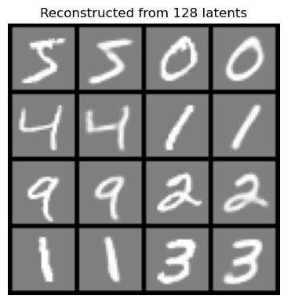

*Figure: VAE reconstructions on MNIST test set (Top: Original, Bottom: Reconstructed)*

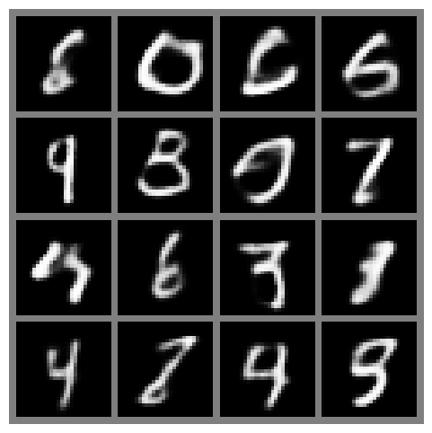

*Figure: Random samples generated from VAE by sampling z ~ N(0, I)*


#### Results - Fashion-MNIST


*Figure: VAE reconstructions on Fashion-MNIST test set*

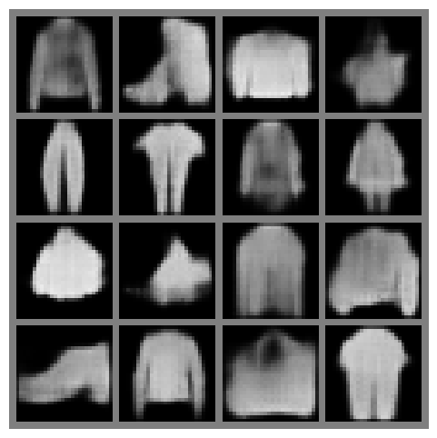

*Figure: Random samples generated from VAE trained on Fashion-MNIST*


#### Comparison: MNIST vs Fashion-MNIST


*Figure 16: Side-by-side comparison of VAE performance on MNIST Digits vs Fashion-MNIST*

**Observations:**
- `[TODO: Compare reconstruction quality]`
- `[TODO: Compare sample diversity]`
- `[TODO: Note differences in convergence speed]`

### Part 3: Flow-VAE (f-VAE)

Not implemented

### Part 4: beta-VAE Exploration

Implemented just functionality to use beta, but without proper experiment comparison for different values.

### Discussion - VAE Section

**What worked well:**
- beta-scheduling with cyclical annealing successfully prevented posterior collapse
- Shared encoder/decoder architecture from standard AE worked well
- VAE generated smoother, more diverse samples than AE

**Why results might not be great:**
- VAE objective encourages blurry reconstructions (MSE/BCE loss)
- Fashion-MNIST has more complex textures than digits
- Gaussian decoder assumption may be too restrictive

**Potential improvements:**
- Use perceptual loss or adversarial loss for sharper reconstructions
- Increase latent dimension to 256 or 512
- Experiment with different decoder distributions (Laplace, mixture of Gaussians)
- Try hierarchical VAE for better modeling of complex distributions
- Implement VQ-VAE for discrete latent representations

---

## Generative Adversarial Networks - GAN (10 points)

### Part 1: Vanilla GAN

#### Architecture

**Generator (Fully Connected):**
```
Input: z ~ N(0, 1), z_dim=128
* Linear(100 x 128) + LeakyReLU(0.2) + BatchNorm
* Linear(128 x 256) + LeakyReLU(0.2) + BatchNorm
* Linear(256 x 512) + LeakyReLU(0.2) + BatchNorm
* Linear(512 x 1024) + LeakyReLU(0.2) + BatchNorm
* Linear(1024 x (28*28)) + Tanh
* Reshape to (1, 28, 28)
```

**Discriminator (Fully Connected):**
```
Input: image (1, 28, 28)
* Flatten to 784
* Linear(784 x 512) + LeakyReLU(0.2)
* Linear(512 x 256) + LeakyReLU(0.2)
* Linear(256 x 1) + Sigmoid
```

**Implementation:** [vanilla.py](gan/vanilla.py), [generator.py](gan/generator.py), [discriminator.py](gan/discriminator.py)

#### Loss Function

Binary Cross-Entropy (BCE) with adversarial objective:
```python
# Discriminator
d_loss = BCE(D(real), 1) + BCE(D(G(z)), 0)

# Generator
g_loss = BCE(D(G(z)), 1)
```

#### Training Details

**Hyperparameters:**
- Latent dimension: 128
- Learning rate: 2e-4
- Optimizer: Adam (beta1=0.5, beta2=0.999)
- Training epochs: 1000

#### Results - MNIST Digits

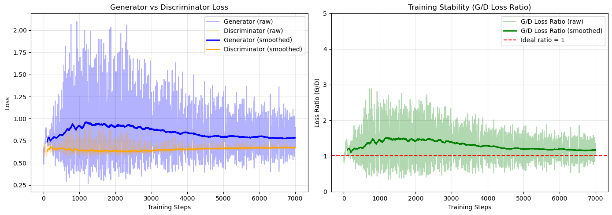

*Figure: Generator and Discriminator loss curves during training on MNIST Digits*

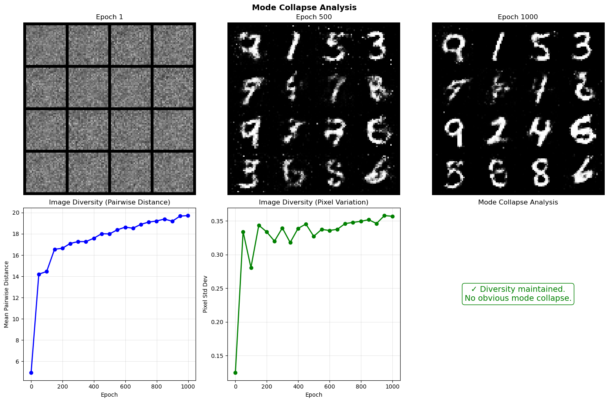

*Figure: Plot with image diversity trough epochs for mode collapse analysis*

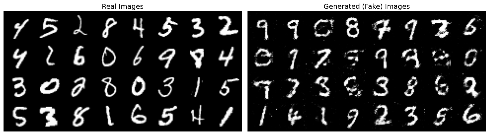

*Figure: Final generated samples from Vanilla GAN trained on MNIST Digits (999 epochs)*


#### Results - Fashion-MNIST

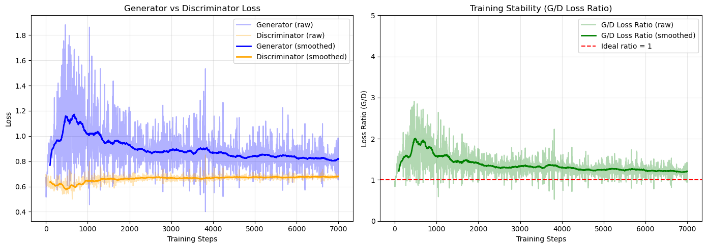

*Figure 22: Generator and Discriminator loss curves during training on Fashion-MNIST*

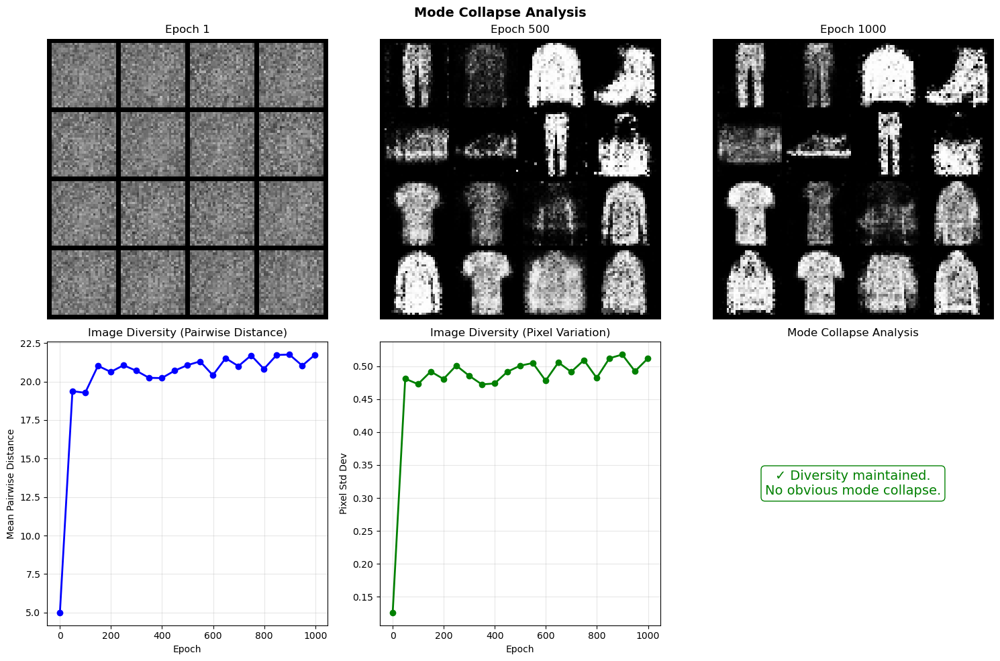

*Figure: Plot with image diversity trough epochs for mode collapse analysis*

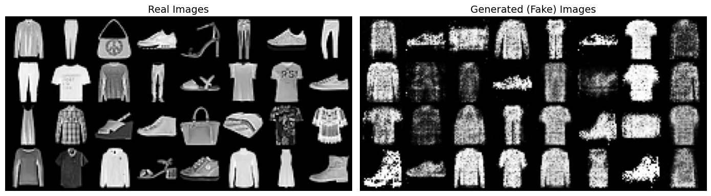

*Figure: Final generated samples from Vanilla GAN trained on Fashion-MNIST*


### Part 2: Conditional GAN (cGAN)

#### Architecture

**Conditional Generator (Convolutional):**
```
Input: [z (128-dim), label (10-dim one-hot)]
* Concat + Linear(128 x 256*7*7) + ReLU
* Reshape to (256, 7, 7)
* ConvTranspose2d(256, 128, k=4, s=2, p=1) + BatchNorm + ReLU  [14x14]
* ConvTranspose2d(128, 64, k=4, s=2, p=1) + BatchNorm + ReLU   [28x28]
* Conv2d(64, 1, k=3, p=1) + Tanh
```

**Conditional Discriminator with Feature Matching:**
```
Input: [image (1, 28, 28), label (10-dim)]
* Label + Linear(10, 28*28) + Reshape + Concat with image [2, 28, 28]
* Conv2d(2, 64, k=4, s=2, p=1) + LeakyReLU  [14x14]=
* Conv2d(64, 128, k=4, s=2, p=1) + BatchNorm + LeakyReLU  [7x7]
* Conv2d(128, 256, k=4, s=2, p=1) + BatchNorm + LeakyReLU  [3x3]
* Conv2d(256, 1, k=3, p=0) + Sigmoid  [1x1]
```

**Implementation:** [cond_gan.py](gan/cond_gan.py), [cond_generator.py](gan/cond_generator.py), [fm_discriminator.py](gan/fm_discriminator.py)

#### Feature Matching Loss

In addition to adversarial loss, generator minimizes:
```python
FM_loss = ||E[f(x_real)] - E[f(G(z))]||
```
where `f(x)` extracts intermediate discriminator features.

**Total Generator Loss:**
```python
g_loss = adversarial_loss + w_FM * feature_matching_loss
w_FM = 10.0
```

**Implementation:** [fm_discriminator.py](gan/fm_discriminator.py)

#### Results - MNIST Digits

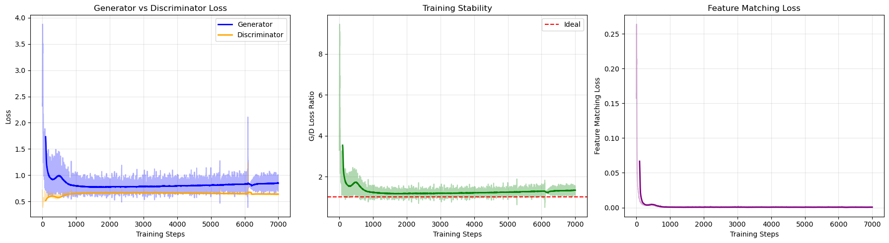

*Figure: Generator loss (adversarial + feature matching) and Discriminator loss for cGAN on MNIST*

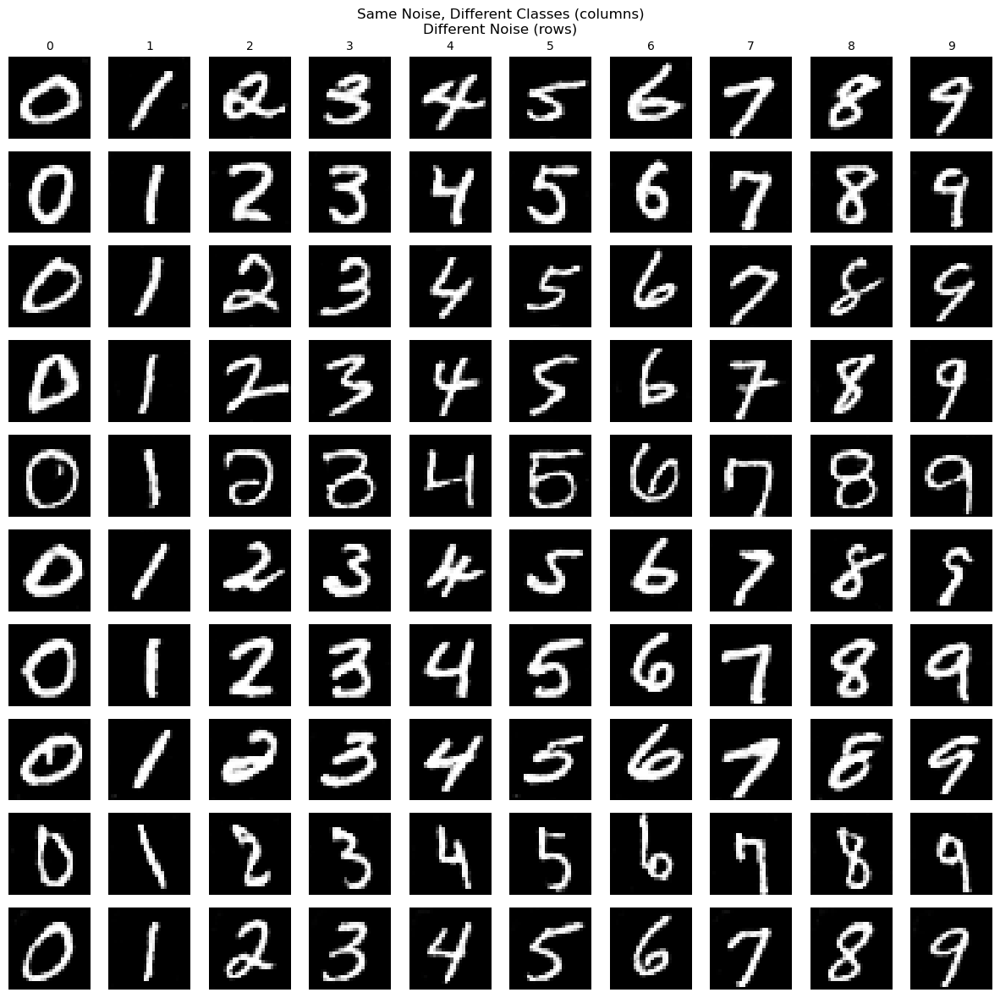

*Figure: Class-conditional generation - each row shows 10 samples for a specific digit (0-9)*


#### Results - Fashion-MNIST

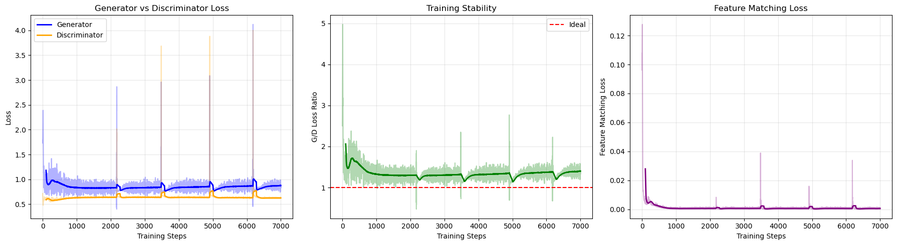

*Figure: Loss curves for cGAN on Fashion-MNIST*

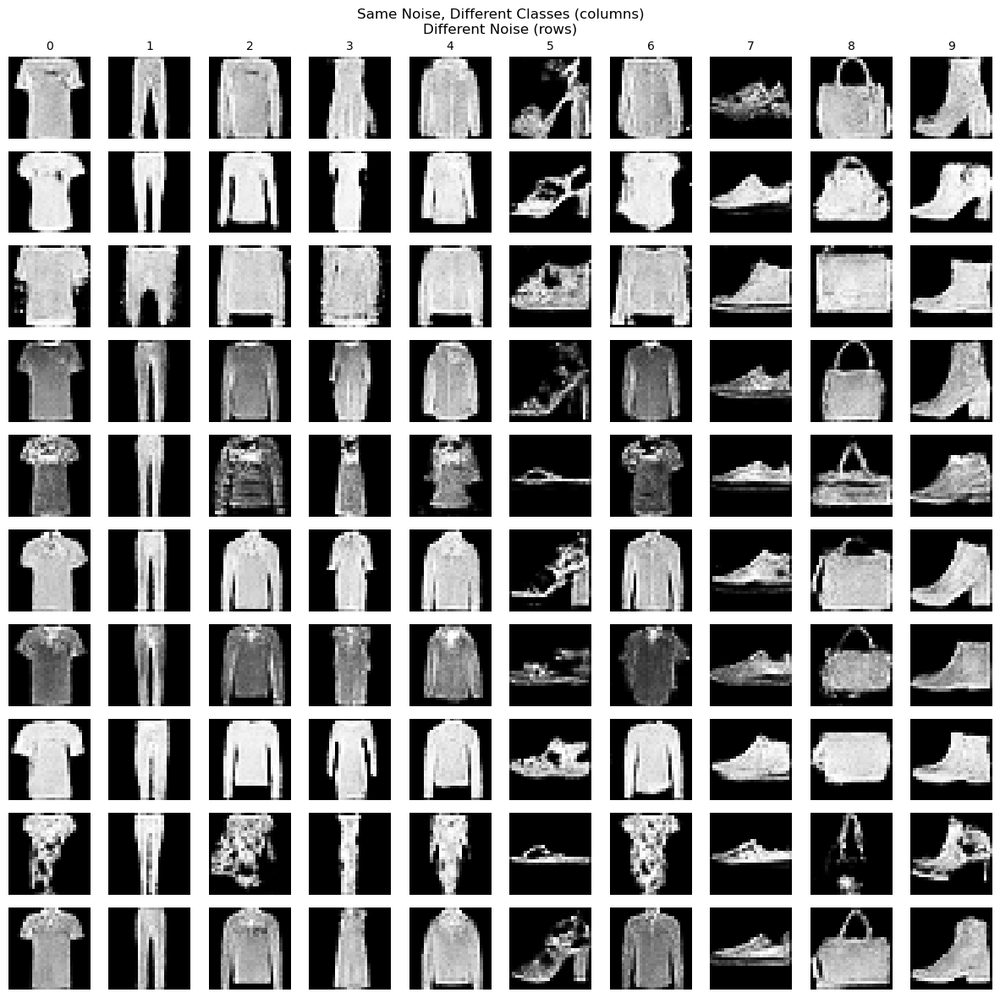

*Figure: Class-conditional generation for Fashion-MNIST classes*


### Discussion - GAN Section

**What worked well:**
- Conditional GAN with feature matching significantly improved training stability
- Class-conditional generation allows controlled sampling
- Convolutional architectures (cGAN) produced sharper images than FC networks
- Feature matching loss reduced mode collapse
- Extended training (1000 epochs) showed continued improvement

**Why results might not be great:**
- Vanilla GAN with FC networks has limited capacity for spatial reasoning
- GAN training is inherently unstable (min-max game)
- Fashion-MNIST is more challenging than MNIST digits
- No progressive growing or other stabilization techniques
- Simple BCE loss may not provide strong gradients for generator

**Potential improvements:**
- Implement Wasserstein GAN with gradient penalty (WGAN-GP) for stable training
- Use spectral normalization in discriminator
- Add self-attention layers for better global coherence
- Implement progressive growing for higher resolution
- Try StyleGAN architecture for better control
- Use PatchGAN discriminator for better texture modeling
- Add diversity loss to prevent mode collapse
- Implement experience replay for discriminator

---

## Overall Discussion and Conclusions

#### Pros and Cons Summary

**RealNVP (Normalizing Flows):**

pros:
- Exact likelihood computation
- Invertible architecture allows both generation and density estimation
- Stable training with clear objective
- Theoretically principled

cons:
- L Complex architecture with many hyperparameters
- L Slower sampling than GAN
- L May produce slightly blurry samples
- L Requires careful design of flow transformations

**VAE (Variational Autoencoder):**

pros:
- Smooth, continuous latent space
- Fast sampling from prior
- Allows interpolation between images
- Stable training with well-defined objective
- Can do both generation and reconstruction

cons:
- Blurry samples due to reconstruction loss
- Requires balancing reconstruction vs KL loss (beta-tuning)
- Posterior collapse can be an issue
- Lower sample quality than GANs

**GAN (Generative Adversarial Network):**

pros:
- Sharpest, most realistic samples
- Fast sampling
- No explicit likelihood needed
- Conditional variants allow controlled generation

cons:
- Training instability (mode collapse, oscillations)
- No density estimation
- Difficult to evaluate (no likelihood)
- Requires careful balancing of G and D
- Vanilla GAN prone to mode collapse


### Future Work

- [ ] Implement f-VAE combining VAE with normalizing flows
- [ ] Experiment with larger datasets (CIFAR-10, CelebA)
- [ ] Implement advanced GAN variants (StyleGAN, Progressive GAN)
- [ ] Try hierarchical VAE for better modeling
- [ ] Implement VQ-VAE for discrete latent representations

### Conclusion

This project successfully implemented and trained three major families of generative models on MNIST and Fashion-MNIST datasets. Each model family has distinct advantages:

- **RealNVP** provides exact likelihood and stable training but requires complex architecture
- **VAE** offers a good balance of stability and generation quality with interpretable latent space
- **GAN** produces the sharpest samples but requires careful training and advanced techniques

---

## References

1. Dinh, L., Sohl-Dickstein, J., & Bengio, S. (2017). Density estimation using Real NVP. *ICLR 2017*.
2. Kingma, D. P., & Welling, M. (2014). Auto-Encoding Variational Bayes. *ICLR 2014*.
3. Goodfellow, I., et al. (2014). Generative Adversarial Nets. *NeurIPS 2014*.
4. Mirza, M., & Osindero, S. (2014). Conditional Generative Adversarial Nets. *arXiv:1411.1784*.
5. Salimans, T., et al. (2016). Improved Techniques for Training GANs. *NeurIPS 2016*.
6. Higgins, I., et al. (2017). �-VAE: Learning Basic Visual Concepts with a Constrained Variational Framework. *ICLR 2017*.
7. Isola, P., et al. (2017). Image-to-Image Translation with Conditional Adversarial Networks (PatchGAN). *CVPR 2017*.
8. PyTorch Lightning Documentation: https://lightning.ai/docs/pytorch/stable/

---