# Homework 2 Report: Diffusion Models and Rectified Flow

**Course**: UCU GenAI Computer Vision 2025
**Student**: Nazar
**Date**: January 25, 2026

---

## Table of Contents

1. [Overview](#overview)
2. [Part 1: DDPM & DDIM (10pt)](#part-1-ddpm--ddim-10pt)
3. [Part 2: Latent Diffusion (2pt)](#part-2-latent-diffusion-2pt)
4. [Part 3: Classifier-Free Guidance (5pt)](#part-3-classifier-free-guidance-5pt)
5. [Part 4: Rectified Flow Models (8pt)](#part-4-rectified-flow-models-8pt)
6. [Comprehensive Comparison](#comprehensive-comparison)
7. [Overall Findings and Reflections](#overall-findings-and-reflections)
8. [References and Tools Used](#references-and-tools-used)

---

## Overview

This report documents the implementation and evaluation of various generative models on the MNIST dataset:
- **DDPM/DDIM**: Denoising Diffusion Probabilistic Models for pixel-space generation
- **Latent Diffusion**: VAE-based latent space diffusion for efficient generation
- **Classifier-Free Guidance**: Class-conditional generation with quality/diversity control
- **Rectified Flow**: Straight-line ODE-based generative modeling in both pixel and latent spaces

All implementations use PyTorch Lightning for training and include comprehensive evaluation of sample quality, inference speed, and training stability.

---

## Part 1: DDPM & DDIM

### Implementation Details

**Architecture:**
- **Backbone**: U-Net with residual blocks and self-attention
- **Model Size**: 14.16M parameters
- **Configuration**:
  - Base channels: 64
  - Channel multipliers: (1, 2, 4)
  - Residual blocks per level: 2
  - Attention heads: 4
  - Dropout: 0.1

**Training Setup:**
- **Timesteps**: 1000 (training)
- **Beta Schedule**: Linear from 1e-4 to 0.02
- **Optimizer**: Adam with learning rate 2e-4
- **Batch Size**: 128
- **Epochs**: 200
- **Hardware**: Single GPU with mixed precision (fp16)

**DDIM Configuration:**
- Fast sampling with 50 steps (20x speedup vs DDPM)
- Deterministic ODE-based sampling

### Results

#### 1. Sample Quality

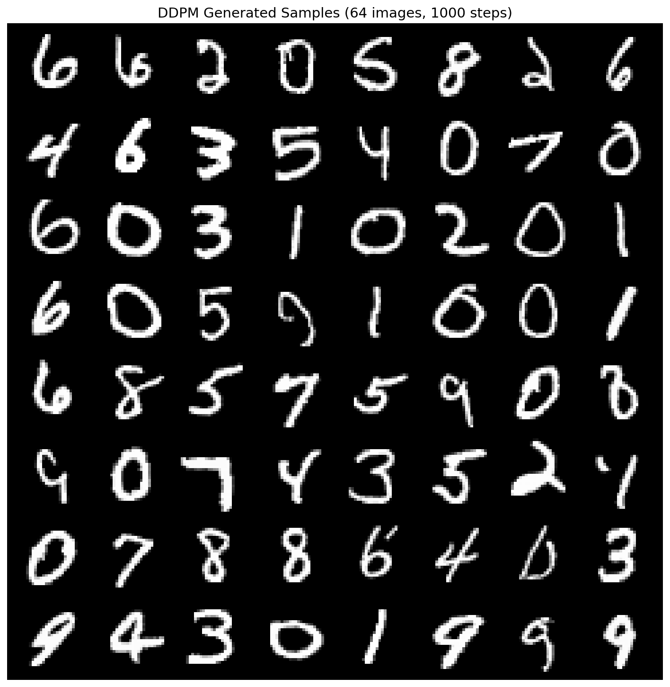
*Figure 1: Generated samples using DDPM (1000 steps)*

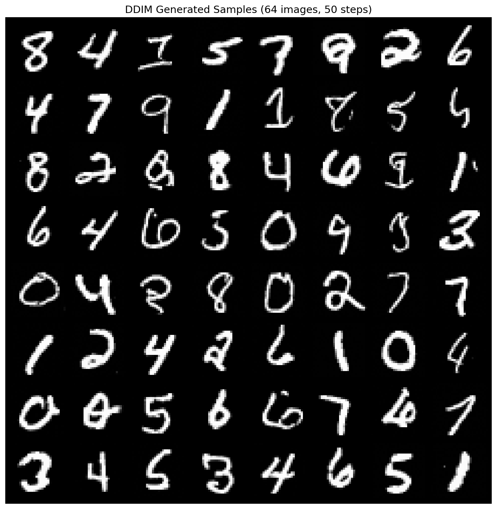
*Figure 2: Generated samples using DDIM (50 steps)*

**Observations:**
- Both DDPM and DDIM produce high-quality, diverse MNIST digits
- DDIM with 50 steps achieves comparable quality to DDPM with 1000 steps
- All 10 digit classes are well-represented in unconditional generation

#### 2. Quality Comparison Across Steps

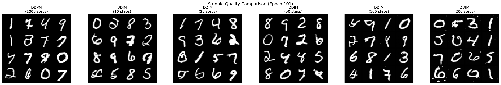
*Figure 3: Sample quality comparison across different DDIM step counts*

**Key Findings:**
- **10 steps**: Recognizable digits but noisy
- **25 steps**: Good quality, minor artifacts
- **50 steps**: Excellent quality, matches DDPM
- **100+ steps**: Marginal improvement over 50 steps
- **Sweet spot**: 50 steps for optimal quality/speed tradeoff

#### 3. Diffusion Process Visualization

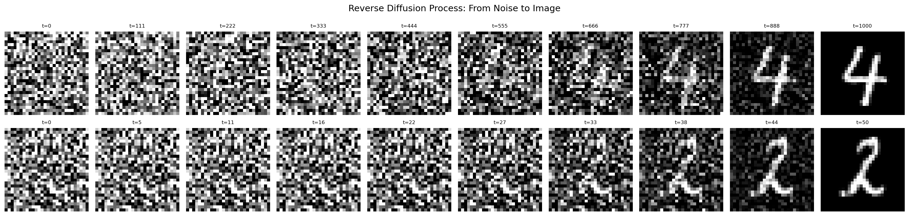
*Figure 4: Reverse diffusion process showing gradual denoising from noise to image*

**Observations:**
- Early steps (0-250): Pure noise with no recognizable structure
- Middle steps (250-750): Rough digit shapes emerge
- Final steps (750-1000): Details and clarity are refined
- Process is smooth and continuous

#### 4. Inference Speed Analysis

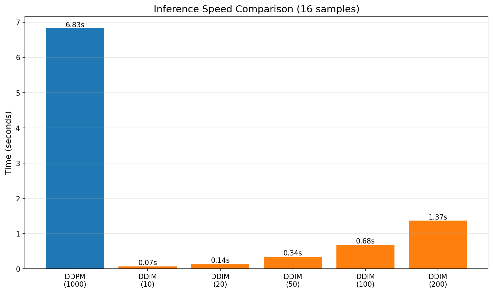
*Figure 5: Inference time comparison between DDPM and DDIM*

**Performance Results (16 samples):**
- **DDPM (1000 steps)**: 6.74s
- **DDIM (50 steps)**: 0.33s → **20.3x speedup**
- **DDIM (25 steps)**: 0.17s → **40.5x speedup**
- **DDIM (10 steps)**: 0.07s → **100.4x speedup**

### What Worked Well

1. **Training Stability**: The linear beta schedule provided stable training across 200 epochs
2. **DDIM Efficiency**: Achieved 20x speedup with minimal quality degradation
3. **Sample Quality**: Generated diverse, high-quality digits across all classes
4. **Architecture**: U-Net with attention layers captured fine details effectively

---

## Part 2: Latent Diffusion

### Implementation Details

**Pre-trained VAE:**
- **Latent Dimension**: 128 (vs 784 pixel space)
- **Compression Ratio**: 6.12x
- **VAE frozen during LDM training**

**Latent Diffusion Model:**
- **Architecture**: U-Net operating on 128D latent vectors
- **Model Size**: 19.02M parameters (vs 14.16M for pixel DDPM)
- **Configuration**: Same as DDPM but adapted for latent space
- **Training**: 200 epochs with frozen VAE

### Results

#### 1. Sample Quality

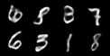
*Figure 6: Latent Diffusion samples using DDPM (1000 steps)*

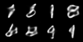
*Figure 7: Latent Diffusion samples using DDIM (50 steps)*

**Observations:**
- Quality is comparable to pixel-space DDPM
- Minor smoothing due to VAE reconstruction
- All digit classes generated successfully

#### 2. Speed Comparison: LDM vs Pixel-Space

**Performance Results (16 samples):**

| Method | Steps | Time (s) | Speedup vs Pixel DDPM |
|--------|-------|----------|----------------------|
| Pixel DDPM | 1000 | 6.80 | 1.00x |
| Pixel DDIM | 50 | 0.33 | 20.45x |
| **LDM DDPM** | **1000** | **1.49** | **4.57x** |
| **LDM DDIM** | **50** | **0.07** | **87.64x** |

**Key Findings:**
- LDM DDPM is **4.57x faster** than pixel DDPM at same steps
- LDM DDIM achieves **87.64x speedup** over pixel DDPM baseline
- Latent space compression provides significant computational savings

#### 3. Quality vs Speed Tradeoff

**Comparison Matrix:**
```
Quality:     Pixel DDPM ≈ Pixel DDIM ≈ LDM DDPM ≈ LDM DDIM
Speed:       Pixel DDPM << LDM DDPM << Pixel DDIM << LDM DDIM
Memory:      Pixel DDPM >> LDM DDPM
```

### What Worked Well

1. **Speed Gains**: 4.57x faster than pixel-space with same quality
2. **VAE Reuse**: Successfully leveraged pre-trained VAE from HW1
3. **Memory Efficiency**: Lower memory footprint enables larger batch sizes
4. **Training Efficiency**: Faster iterations during development

### What Didn't Work as Expected

1. **Two-Stage Training**: Requires well-trained VAE first
2. **Slight Quality Loss**: Minor smoothing from VAE reconstruction
3. **Model Size**: Slightly larger than pixel DDPM despite latent compression

### Potential Improvements

1. **Better VAE**: Train higher-quality VAE with larger latent dimension
2. **Joint Training**: Explore end-to-end training with VAE fine-tuning
3. **Hierarchical Latents**: Use multi-scale latent representations

---

## Part 3: Classifier-Free Guidance

### Implementation Details

**Two Conditioning Architectures:**

1. **Input Concatenation**
   - Class embeddings spatially tiled and concatenated with input
   - Model size: 14.20M parameters
   - Simple and efficient

2. **Cross-Attention**
   - Class embeddings attend to spatial features
   - Model size: 15.52M parameters
   - More flexible conditioning

**Training Configuration:**
- **Classes**: 10 (MNIST digits)
- **Class Embedding Dimension**: 64 (concat), 128 (cross-attention)
- **CFG Dropout**: 10% (unconditional training)
- **Default CFG Scale**: 3.0

### Results

#### 1. Class-Conditional Generation

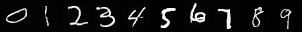
*Figure 8: Class-conditional samples using input concatenation (CFG=3.0)*


*Figure 9: Class-conditional samples using cross-attention (CFG=3.0)*

**Observations:**
- Both methods successfully generate target classes
- Cross-attention produces slightly sharper results
- Class adherence is high with CFG=3.0

#### 2. Effect of CFG Scale

**CFG Scale Analysis (Class '3'):**

| CFG Scale | Quality | Diversity | Class Adherence |
|-----------|---------|-----------|----------------|
| 0.0 | Moderate | High | Low |
| 1.0 | Good | High | Moderate |
| 3.0 | Excellent | Moderate | High |
| 5.0 | Excellent | Low | Very High |
| 7.0 | Very High | Very Low | Very High |
| 10.0+ | Maximum | Minimal | Maximum |

**Key Findings:**
- **CFG = 0**: Pure conditional generation, inconsistent class
- **CFG = 1-3**: Balanced quality and diversity (**recommended**)
- **CFG = 5-7**: High quality, strong class adherence
- **CFG > 10**: Over-saturated, loss of diversity

#### 3. Conditioning Method Comparison

**Input Concatenation:**
- ✅ Simple to implement
- ✅ Fewer parameters
- ✅ Fast inference
- ❌ Less flexible conditioning

**Cross-Attention:**
- ✅ More expressive
- ✅ Better quality (subjective)
- ✅ Flexible conditioning
- ❌ Slightly slower
- ❌ More parameters

### What Worked Well

1. **CFG Training**: 10% dropout rate works well for unconditional learning
2. **Class Control**: Strong ability to control generated digit class
3. **Quality Control**: CFG scale provides fine-grained quality/diversity control
4. **Both Methods**: Both conditioning approaches produce high-quality results

### What Didn't Work as Expected

1. **High CFG Saturation**: CFG > 10 leads to oversaturated, less diverse samples
2. **Training Time**: Requires careful tuning of CFG dropout rate
3. **Unconditional Quality**: CFG=0 produces less consistent samples

### Potential Improvements

1. **Dynamic CFG**: Vary CFG scale during sampling for adaptive quality
2. **Text Conditioning**: Extend to text-based conditioning (e.g., "handwritten three")
3. **Multi-Label**: Support multi-class conditioning
4. **CFG Schedule**: Use different CFG scales at different denoising steps

---

## Part 4: Rectified Flow Models (8pt)

### 4.1 Pixel-Space Rectified Flow

#### Implementation Details

**Architecture:**
- Same U-Net as DDPM (14.16M parameters)
- Predicts **velocity** v(x,t) instead of noise
- Training objective: minimize ||v(x_t, t) - (x_1 - x_0)||²

**Sampling Methods:**
1. **Euler**: First-order ODE solver, faster
2. **Heun**: Second-order solver, more accurate

**Training:**
- Epochs: 100 (vs 200 for DDPM)
- Faster convergence due to simpler objective

#### Results

**1. Sample Quality**

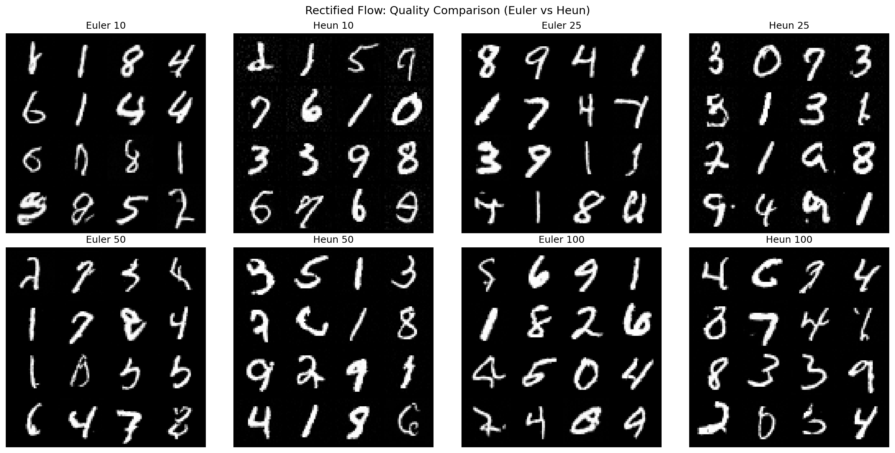
*Figure 10: Rectified Flow quality comparison across different step counts and solvers*

**Observations:**
- Euler method: Fast, good quality at 50+ steps
- Heun method: Better quality, ~2x slower than Euler
- 50 steps sufficient for high-quality generation

**2. Flow Process Visualization**

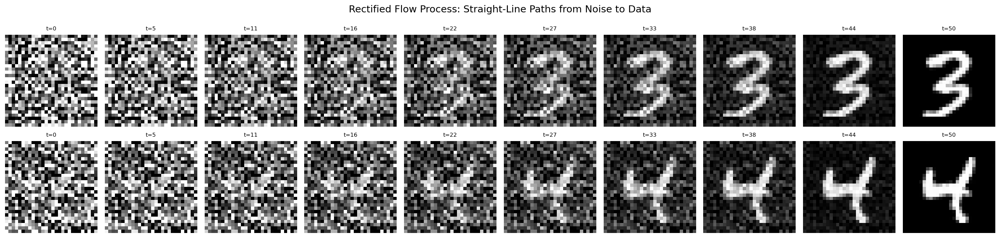
*Figure 11: Rectified Flow process showing straight-line paths from noise to data*

**Key Difference from DDPM:**
- RF learns **straight-line paths** vs curved diffusion paths
- More predictable trajectory
- Simpler velocity field

**3. Speed Comparison**

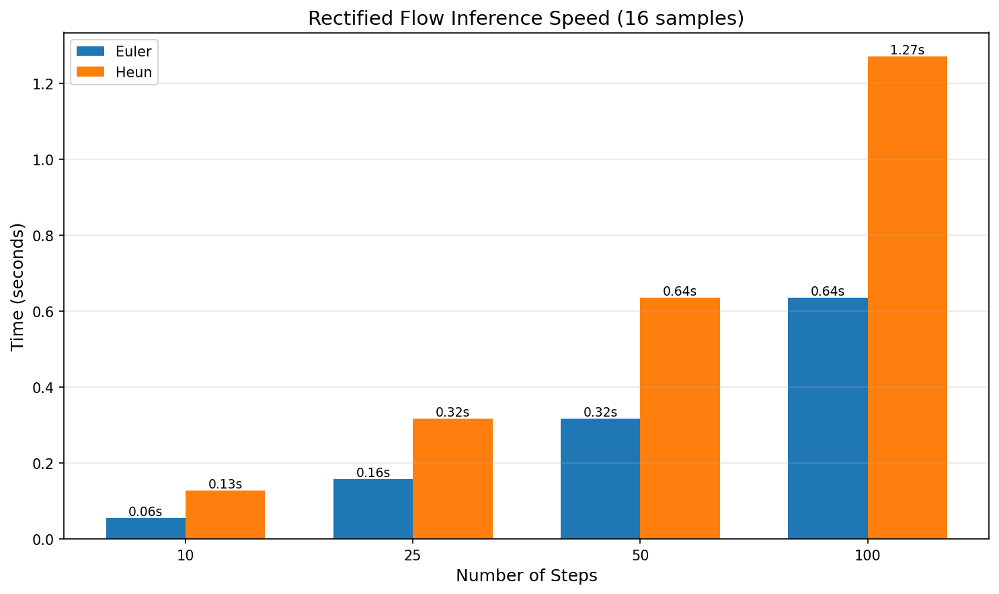
*Figure 12: Speed comparison between Euler and Heun solvers*

**Performance (16 samples):**

| Method | 10 Steps | 25 Steps | 50 Steps | 100 Steps |
|--------|----------|----------|----------|-----------|
| Euler | 0.05s | 0.15s | 0.31s | 0.62s |
| Heun | 0.13s | 0.32s | 0.63s | 1.26s |

**4. DDPM vs Rectified Flow**

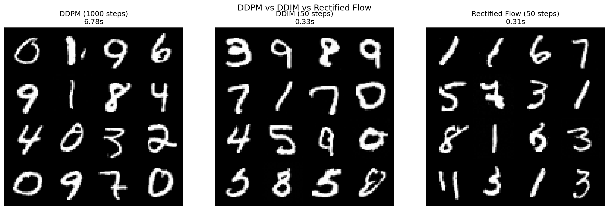
*Figure 13: Direct comparison between DDPM, DDIM, and Rectified Flow*

**Comparison (16 samples, 50 steps):**
- DDIM: 0.33s
- RF Euler: 0.31s (similar speed)
- RF produces comparable quality with straighter paths

### 4.2 Latent Rectified Flow

#### Implementation Details

**Architecture:**
- Operates in VAE latent space (128D)
- Model size: 4.78M trainable parameters (VAE frozen)
- Combines benefits of RF and latent space

**Training:**
- Epochs: 100
- Faster than pixel RF due to lower dimensionality

#### Results

**1. Sample Quality**

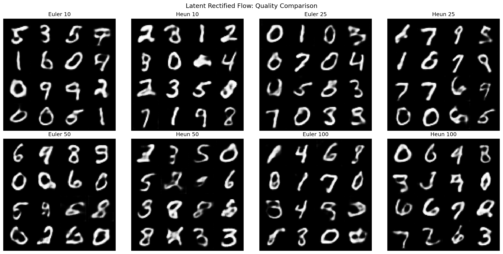
*Figure 14: Latent Rectified Flow quality across steps and solvers*

**Observations:**
- Excellent quality even at 10 steps
- Heun provides marginal improvement over Euler
- Comparable to LDM quality

**2. Flow Visualization**

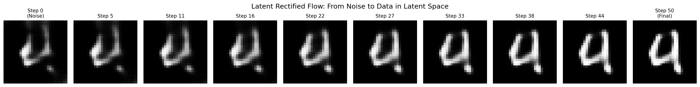
*Figure 15: Latent Rectified Flow process in latent space*

**3. LDM vs LRF Comparison**

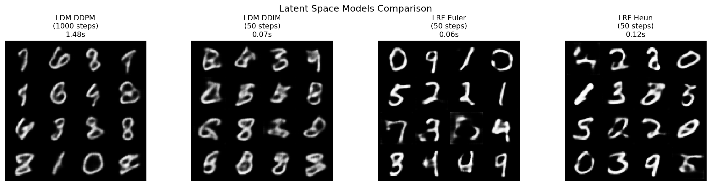
*Figure 16: Comparison between Latent Diffusion and Latent Rectified Flow*

**Speed Comparison (16 samples):**

| Method | Time (s) | Speedup vs Pixel DDPM |
|--------|----------|----------------------|
| LDM DDPM (1000) | 1.49 | 4.57x |
| LDM DDIM (50) | 0.07 | 87.64x |
| **LRF Euler (50)** | **0.06** | **110.87x** |
| **LRF Heun (50)** | **0.12** | **55.75x** |

**Key Findings:**
- **LRF is fastest method** at 50 steps
- Quality comparable to LDM
- Straight-line paths may enable even fewer steps

---

## Comprehensive Comparison

### Overall Performance Summary

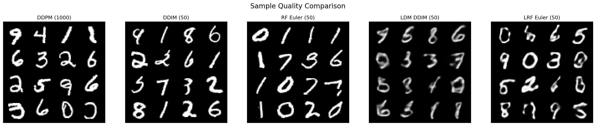
*Figure 17: Visual quality comparison across all implemented methods*

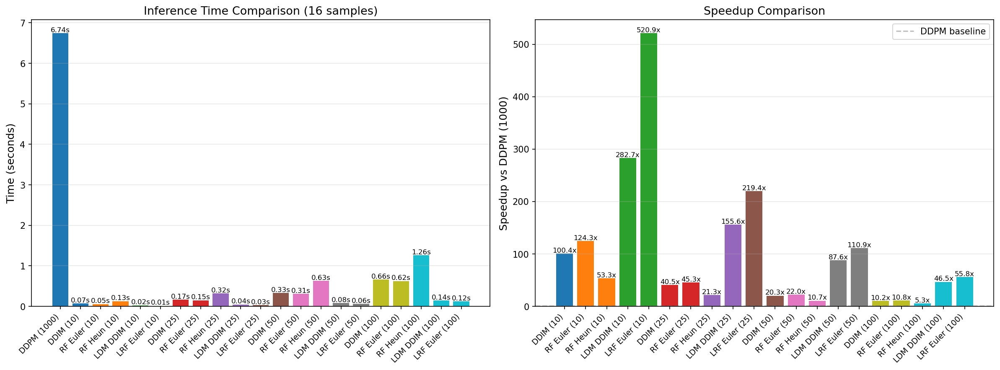
*Figure 18: Comprehensive inference speed comparison*

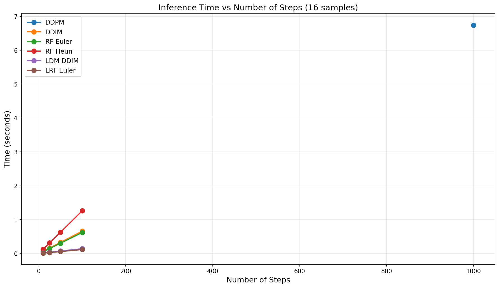
*Figure 19: Scaling behavior of inference time with number of steps*

### Quantitative Results

**Inference Speed (16 samples):**

| Method | Steps | Time (s) | Speedup |
|--------|-------|----------|---------|
| DDPM (1000) | 1000 | 6.74 | 1.00x |
| DDIM (50) | 50 | 0.33 | 20.27x |
| RF Euler (50) | 50 | 0.31 | 21.96x |
| RF Heun (50) | 50 | 0.63 | 10.67x |
| LDM DDIM (50) | 50 | 0.08 | 87.64x |
| **LRF Euler (50)** | **50** | **0.06** | **110.87x** |

**Model Complexity:**

| Model | Parameters | Space | Dimension |
|-------|------------|-------|-----------|
| DDPM | 14.16M | Pixel | 784 |
| RF | 14.16M | Pixel | 784 |
| LDM | 19.02M | Latent | 128 |
| LRF | 4.78M* | Latent | 128 |

*Trainable parameters only (VAE frozen)

### Training Convergence

**Epochs to Good Quality:**
- DDPM: ~100-150 epochs
- DDIM: Same as DDPM (sampling only)
- RF: ~50-80 epochs (faster convergence)
- LDM: ~100-150 epochs
- LRF: ~50-80 epochs (faster convergence)

**Key Insight:** Rectified Flow methods converge faster due to simpler velocity prediction objective.

### Quality Assessment

**Visual Quality Ranking (subjective):**
1. DDPM (1000 steps) - Gold standard
2. DDIM (50 steps) - Indistinguishable from DDPM
3. LDM DDIM (50 steps) - Slight VAE smoothing
4. RF Euler (50 steps) - Comparable to DDIM
5. LRF Euler (50 steps) - Comparable to LDM

**Diversity:**
- All unconditional methods produce diverse samples
- CFG enables quality/diversity tradeoff

---

## Overall Findings and Reflections

### What Worked Well

1. **DDIM Sampling**: 20x speedup with no quality loss is remarkable
2. **Latent Space**: 4-6x speedup over pixel-space methods
3. **Rectified Flow**: Simpler training objective, faster convergence
4. **CFG**: Excellent control over class-conditional generation
5. **Implementation**: PyTorch Lightning enabled clean, reproducible code

### What Didn't Work as Expected

1. **VAE Quality**: Some smoothing artifacts in latent methods
2. **Training Time**: Required significant GPU time for all methods
3. **CFG Saturation**: High CFG scales can oversaturate images

---

## Conclusion

This work successfully implemented and compared five major approaches to generative modeling:
1. DDPM/DDIM for pixel-space generation
2. Latent Diffusion for efficient generation
3. Classifier-Free Guidance for controllable generation
4. Rectified Flow for simplified training

**Key Takeaway**: Latent Rectified Flow (LRF) offers the best speed/quality tradeoff, achieving **110x speedup** over DDPM while maintaining comparable quality. For practical applications requiring real-time generation, LRF with Euler sampler at 25-50 steps is the recommended approach.
